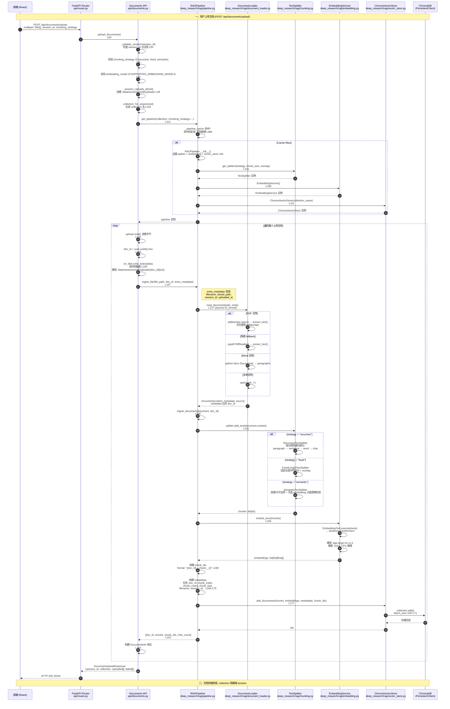
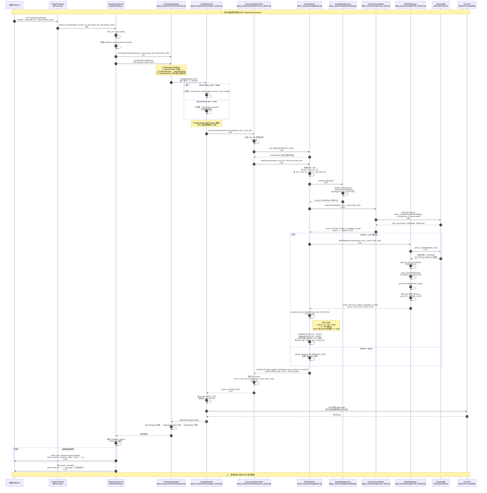
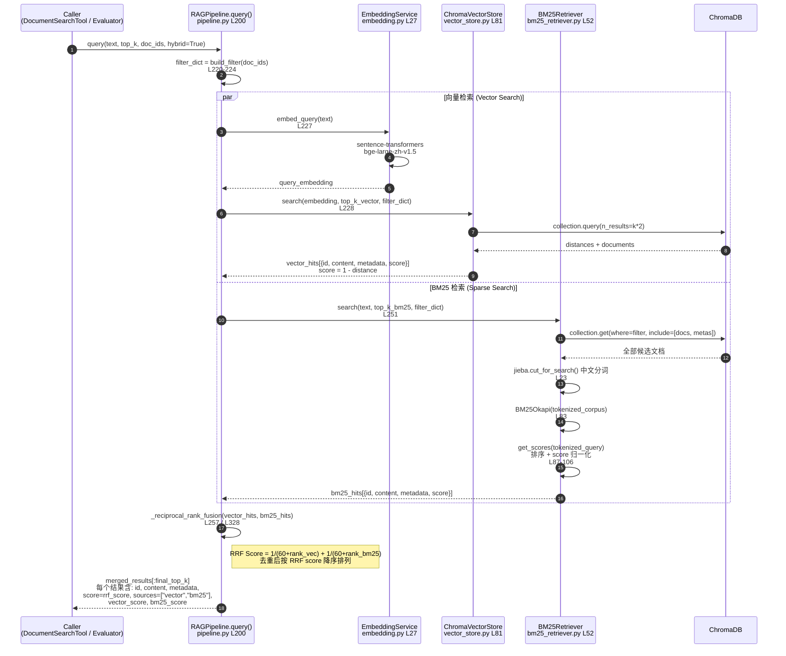

# DeepResearchX 文档处理与查询检索时序流程图

---

## 图 1：文档上传 → 切分 → 嵌入 → 存储

---

## 图 2：查询 → 向量检索 → BM25 检索 → RRF 融合 → 返回

---

## 图 3：RAGPipeline.query() 内部细节 (Hybrid Retrieval)

---

## 关键数据流与 ID 格式

| 阶段 | 关键 ID / 格式 | 代码位置 |
|------|---------------|---------|
| **Session ID** | 用户提供的会话标识 | `api/documents.py:64` |
| **Collection 名** | `session_uploads_{sid}` + hash 后缀 | `pipeline.py:77` `_safe_collection_name()` |
| **Doc ID** | `uuid.uuid4().hex` (32 位十六进制) | `api/documents.py:155` |
| **Chunk ID** | `{doc_id}__chunk__{i}` | `pipeline.py:168` |
| **文件存储路径** | `./deep_research/data/sessions/{sid}/uploads/{doc_id}{ext}` | `api/documents.py:158` |
| **Embedding 模型** | `BAAI/bge-large-zh-v1.5` (本地, 1024-dim) | `config/default.yaml` |
| **BM25 分词** | `jieba.cut_for_search()` | `bm25_retriever.py:23` |
| **RRF 常数 k** | `60` (可配置) | `pipeline.py:331` |
| **Chroma 距离函数** | `cosine` (默认) | `vector_store.py:46` |

---

## 切分策略对比

| 策略 | 实现类 | 核心逻辑 | 适用场景 |
|------|--------|---------|---------|
| **recursive** | `RecursiveTextSplitter` | 按分隔符递归拆分: `\n\n` → `\n` → `。！？` → 空格 → 字符 | 通用场景, 保留自然边界 |
| **fixed** | `FixedLengthTextSplitter` | 固定长度字符切分 + overlap | 最快, 最可预测 |
| **semantic** | `SemanticTextSplitter` | 段落/句子边界 + 可选 embedding 主题漂移合并 | 最佳语义保留, 较慢 |

---

*生成时间: 2026-05-22*
*基于代码版本: main branch (commit c90aa4f)*
